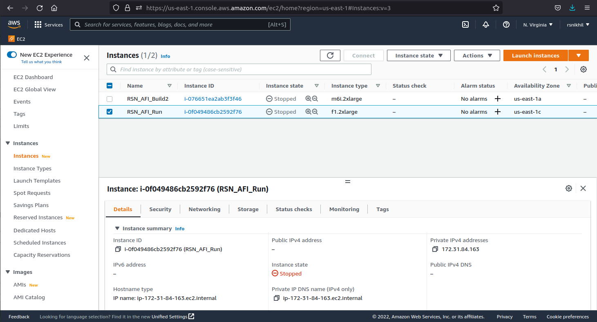

.. include:: z00_Replacements.rsti

.. _Sec_Setting_up_Instance:

================================================================
Setting up your "instance" (virtual machine in AWS cloud)
================================================================

Once you have an Amazon AWS account, you can create one or more
"instances" in the cloud.  Each instance is a virtual machine running
a standard operating system such as Ubuntu or CentOS.  From your local
machine (laptop/desktop), you can connect to your instance and
interact with it using ``ssh``, |IE| the same, usual way that one
interacts with any remote Linux machine.

----------------------------------------------------------------
Bring up the EC2 Instances Dashboard
----------------------------------------------------------------

AWS offers a very large number of services.  For our purposes (FPGA
development), please select "EC2" ("Elastic Computing"). From the EC2
web page, please select "Instances", which should land you in the EC2
Instances Dashboard, similar to that shown in
:numref:`Fig_AWS_EC2_Instances_Dashboard`.

	    AWS EC2 Instances Dashboard showing one's instances

In the dashboard, the "Instances" panel will list all the instances
that you have created.  The figure shows two instances called
"RSN_AFI_Build2" and "RSN_AFI_Run".

.. COMMENT ****************************************************************

.. index:: AMI
.. index:: Instance
.. index:: Instance; type
.. index:: F1 instance
.. index:: Instance; F1
.. index:: AWS Access Key
.. _Sec_AMI:

----------------------------------------------------------------
Create an Instance and Access Key
----------------------------------------------------------------

From the EC2 Instances Dashboard, please select "Launch Instances"
(button near top-right) which will start a "wizard" that takes you
through the following steps for defining and creating an instance.

^^^^^^^^^^^^^^^^^^^^^^^^^^^^^^^^^^^^^^^^^^^^^^^^^^^^^^^^^^^^^^^^
Provide a name for your new instance
^^^^^^^^^^^^^^^^^^^^^^^^^^^^^^^^^^^^^^^^^^^^^^^^^^^^^^^^^^^^^^^^

On the "Launch Instances" wizard page, the first section is titled
"Name and tags", see
:numref:`Fig_AWS_Launch_Instance_010_Name_and_tags`:

	    "Name and tags" section of Launch Instances screen.

Type a name for your instance into the text box.

^^^^^^^^^^^^^^^^^^^^^^^^^^^^^^^^^^^^^^^^^^^^^^^^^^^^^^^^^^^^^^^^
Select an AMI from the AWS catalog, and an Instance Type
^^^^^^^^^^^^^^^^^^^^^^^^^^^^^^^^^^^^^^^^^^^^^^^^^^^^^^^^^^^^^^^^

On the "Launch Instances" wizard page, the next two sections are
titled "Application and OS Images (Amazon Machine Image)", see
:numref:`Fig_AWS_Launch_Instance_020_Choose_AMI`,
and "Instance type", see
:numref:`Fig_AWS_Launch_Instance_030_Instance_Type`:

	    "Application and OS Images (Amazon Machine Image)" section of Launch Instances screen.

	    "Instance Type" section of Launch Instances screen.

An "AMI" is a software template from which you create your instance.
It is a pre-load of your virtual memory software, in particular an
operating system like Ubuntu or CentOS, plus any application software
pre-loaded into that operating system, such as Xilinx Vivado software.

An "Instance Type" specifies the type of computer hardware and its
configuration, in the AWS cloud, on which your instance should run:
x86 or ARM, number of processors, amount of memory and disk, |ETC|
Instance Types named "f1.XXXX" are *the only ones that have attached
FPGAs*.

When creating an instance, we choose both an AMI and an Instance Type
on which it will run.

When we are developing FPGA hardware and running applications using
FPGAs, we can regard our activities in three categories, each of which
can be satisfied by a different combination of AMI and Instance Type:

1. Developing the hardware that will eventually run on the FPGA.  This
   involves creation of Verilog RTL, simulating it and verifying it.

   This does not need an attached FPGA.  On AWS, almost any AMI and
   Instance Type with sufficient compute power will do.  It can also
   be performed on a local machine (does not have to be on AWS).

   We recommend selecting a standard, free, Ubuntu AMI, and the
   ``m6i.2xlarge`` or ``z1d.2xlarge`` Instance Type.

2. Synthesizing the Verilog RTL into a bitfile for the AWS FPGA.

   This is most conveniently performed on an AWS instance based on the
   AWS "FPGA Developers' AMI", which is pre-loaded with the AWS HDK
   (Hardware Develpment Kit), Vivado software and Vivado licenses, and
   scripts needed to create the AWS FPGA bitfile.  It does not need an
   attached FPGA.

   We recommend selecting the "FPGA Developers' AMI" and the
   ``m6i.2xlarge`` or ``z1d.2xlarge`` Instance Type.

3. Loading a bitfile into the FPGA to program its functionality, and
   running software to interact with the FPGA hardware.  This, of
   course, needs an "f1" instance with the attached FPGA.  The AMI
   could be Ubuntu or CentOS; the key requirement for the OS is that
   should support the XDMA device driver (about which more, later) for
   communicating with the FPGA.

    We recommend selecting a standard, free, Ubuntu AMI, or the "FPGA
    Developers' AMI" (both support the XDMA driver), and the
    ``f1.2xlarge`` Instance Type.

To select an AMI, you can search for "Ubuntu" and "FPGA Developers'
AMI" in the "Search our full catalog ..." text box.  It will offer you
a choice like this, for example:

    Ubuntu Server 22.04 LTS (HVM), SSD Volume Type
    ami-052efd3df9dad4825 (64-bit (x86)) / ami-070650c005cce4203 (64-bit (Arm))

    Ubuntu Server 22.04 LTS (HVM),EBS General Purpose (SSD) Volume
    Type. Support available from Canonical (http://www.ubuntu.com/cloud/services).

Make sure the "64-bit (x86)" button is selected (and not the "64-bit
(Arm)" button), and click "SELECT".  This should now show your
selection, as in :numref:`Fig_AWS_Launch_Instance_020_Choose_AMI`.

To select an Instance Type, the selection box will have preselected
the ``t2.micro`` Instance Type.  Change this by clicking on the caret
at the right end of the box which opens a search box.  Enter
``f1.2xlarge`` or ``m6i.2xlarge`` and select it from the list.

""""""""""""""""""""""""""""""""""""""""""""""""""""""""""""""""
One instance or several?
""""""""""""""""""""""""""""""""""""""""""""""""""""""""""""""""

Why not make just one instance for all our development activity?

One reason is cost.  AWS' usage charges vary by instance type, and
unfortunately "f1" instances are generally more expensive than other
Instance Types.  Further, charges are mostly accrued while actually
running an instance; "stopped" (suspended) instances have
comparatively negligible charges.  Thus, for development work
(creating RTL, RTL simulation, verification with RTL simulation,
host-side software development, |ETC|) we might choose an Instance
Type that is *not* an "f1" instance.  We may only start running and
use the "f1" instance while we are actually using the FPGA, keeping it
stopped at other times.

Another reason is preference---for example, one may prefer the Ubuntu
environment over CentOS, or vice versa.

.. COMMENT ****************************************************************

.. index:: Key Pair
.. _Sec_Create_Key_Pair:

^^^^^^^^^^^^^^^^^^^^^^^^^^^^^^^^^^^^^^^^^^^^^^^^^^^^^^^^^^^^^^^^
Create your Key Pair
^^^^^^^^^^^^^^^^^^^^^^^^^^^^^^^^^^^^^^^^^^^^^^^^^^^^^^^^^^^^^^^^

On the "Launch Instances" wizard page, the
next section is titled "Key pair (login)", see
:numref:`Fig_AWS_Launch_Instance_040_Key_Pair`:

	    "Key Pair" section of Launch Instances screen.

*What this is:* later, when you use ``ssh`` to connect to your
instance, or use ``scp`` to copy files in and out of the instance, you
will use this Key Pair to authenticate yourself.  AWS uses
cryptographic access keys for authentication rather than the older,
less secure password mechanism.

The screen shows a slot where you can select an existing key pair if
you already have one from previous uses of AWS (click on down-caret on
the right to select an existing key pair), or you can click on "Create
new key pair" to create one.

Follow the prompts to create an access key pair, which is a pair of
rather long ASCII key strings, randomly generated to be
cryptographically secure.  One of these is called your "public key"
and the other is your "private key".  The prompts will ask you to cut
and paste the private key into a file on your local computer
(laptop/desktop). Typically this file is placed in your ${HOME}/.ssh/
directory with filename extention ``.pem``, like this:

.. code::

    ~/.ssh/RSN_AWS.pem

You will refer to this file later when using ``ssh`` to connect to
your instance (see :numref:`Sec_connecting_to_an_instance`).

.. tip:: You can create a new access key at any time; it does not have
         to be during instance creation.  In your EC2 dashboard, clicking
         on your login id on the top-right will drop down a menu with
         a "Security Credentials" option.  This will take you to a
         screen where "Access Keys" is one of the topics, with a
         "Create access key" button to create a new one.  It is a good
         practice to change your access key every so often.

^^^^^^^^^^^^^^^^^^^^^^^^^^^^^^^^^^^^^^^^^^^^^^^^^^^^^^^^^^^^^^^^
Network Settings for your instance
^^^^^^^^^^^^^^^^^^^^^^^^^^^^^^^^^^^^^^^^^^^^^^^^^^^^^^^^^^^^^^^^

On the "Launch Instances" wizard page, the next section is titled
"Network settings", see
:numref:`Fig_AWS_Launch_Instance_050_Network_Settings`:

	    "Network Settings" section of Launch Instances screen.

We recommend leaving everything here unchanged. In particular:

* "Auto-assign public IP" = "Enable"
* "Allow SSH traffic from Anywhere"

.. note:: You can update the network settings later if you wish/need to.

^^^^^^^^^^^^^^^^^^^^^^^^^^^^^^^^^^^^^^^^^^^^^^^^^^^^^^^^^^^^^^^^
Configure Storage
^^^^^^^^^^^^^^^^^^^^^^^^^^^^^^^^^^^^^^^^^^^^^^^^^^^^^^^^^^^^^^^^

On the "Launch Instances" wizard page, the next section is titled
"Configure Storage", see
:numref:`Fig_AWS_Launch_Instance_060_Configure_Storage`:

	    "Configure Storage" section of Launch Instances screen.

We recommend leaving everything here unchanged.

.. note:: You can update the storage settings later if you wish/need to.

^^^^^^^^^^^^^^^^^^^^^^^^^^^^^^^^^^^^^^^^^^^^^^^^^^^^^^^^^^^^^^^^
Advanced details
^^^^^^^^^^^^^^^^^^^^^^^^^^^^^^^^^^^^^^^^^^^^^^^^^^^^^^^^^^^^^^^^

On the "Launch Instances" wizard page, the next section is titled
"Advanced details".  We recommend leaving everything here unchanged.

^^^^^^^^^^^^^^^^^^^^^^^^^^^^^^^^^^^^^^^^^^^^^^^^^^^^^^^^^^^^^^^^
Summary panel
^^^^^^^^^^^^^^^^^^^^^^^^^^^^^^^^^^^^^^^^^^^^^^^^^^^^^^^^^^^^^^^^

"Summary" is a floating panel on the right-hand side of "Launch
Instances" wizard page, |IE| it stays visible as you scroll the page,
see :numref:`Fig_AWS_Launch_Instance_070_Summary`:

	    "Summary" section of Launch Instances screen.

^^^^^^^^^^^^^^^^^^^^^^^^^^^^^^^^^^^^^^^^^^^^^^^^^^^^^^^^^^^^^^^^
Launch your new instance
^^^^^^^^^^^^^^^^^^^^^^^^^^^^^^^^^^^^^^^^^^^^^^^^^^^^^^^^^^^^^^^^

Click the "Launch instance" button on the "Summary" panel.  It will
flash up a "Launching Instance" panel and shortly transition to
"Success", see :numref:`Fig_AWS_Launch_Instance_080_Success`:

	    "Success" on the "Launch an Instance" screen.

.. important::

   After clicking "Launch instance", AWS may present a failure message like this:

       |    You have requested more vCPU capacity than your current vCPU
       |    limit of 0 allows for the instance bucket that the specified
       |    instance type belongs to. Please visit
       |    http://aws.amazon.com/contact-us/ec2-request to request an
       |    adjustment to this limit.

   If you get this message, please visit the ``contact-us`` link
   shown, click on the "Support" button and lodge a request to
   increase your "vCPU quota" to 8, which is required for the
   ``f1.2xlarge`` instance type.  Try to include a few sentences
   explaining your need for an ``f1.2xlarge`` instance type.

   You will get an almost instance response saying:

       |    This specific limit increase request requires further internal review before approval ...

   These requests are processed by humans, so it may take a few hours
   before you receive an email indicating that your request has been
   approved, after which you can proceed.

----------------------------------------------------------------
See your new instance on the EC2 Instances dashboard
----------------------------------------------------------------

Click the "View all instances" button on the "Launch an instance:
Success" screen.  This will return you to the EC2 Instances dashboard,
see :numref:`Fig_AWS_Launch_Instance_090_Instances_Initializing`, for
exaample:

	    "EC2 Instances" screen, showing an instance initializing.

Your new instance should be listed there, with the name you supplied.
The "Instance state" column will initially say "Stopped".  When you
start the instance (see next section) it will say "Pending", then
"Running".  The "Status check" column will say "initializing", then
"2/2 checks passed".  See
:numref:`Fig_AWS_Launch_Instance_100_Instances_Running`:

	    "EC2 Instances" screen, showing an instance running.

All this may take about a minute; you may wish to press the refresh
icon |ICON_REFRESH| to update the dashboard display.

**Congratulations!** You have just created your AMI for FPGA development!
