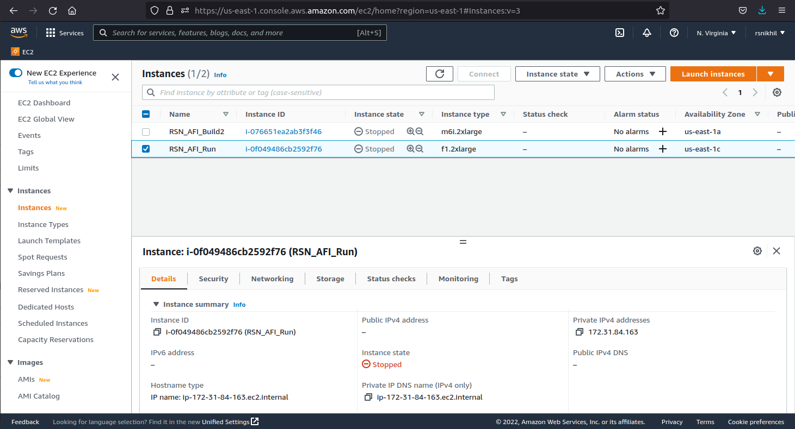
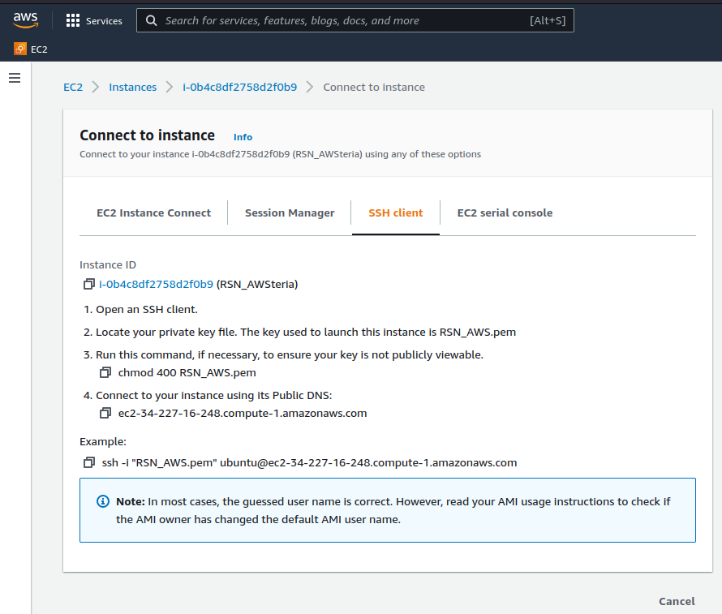
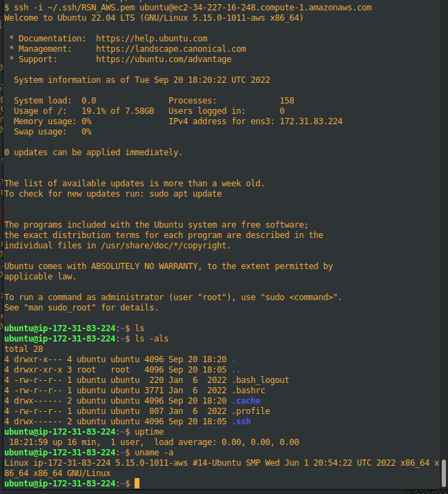

.. include:: z00_Replacements.rsti

.. COMMENT ****************************************************************

================================================================
Using an instance
================================================================

One uses an instance exactly like one uses any remote Linux server: we
``ssh`` to the instance, which connects us to a ``bash`` shell running
on the instance, which we use just like we do on any Linux machine.

But first, let us see how to "start" ("spin up") and "stop"
("suspend", "spin down") an instance from the EC2 dashboard.  We
should spin down any instance that we're not going to use for some
time (|EG| for a day or more), both for cost reasons (most AWS charges
are for instances that are actually running) and to avoid wasting
resources---a running instance has to be allocated to an actual
physical machine somewhere in the cloud, whereas a stopped machine is
merely parked on disk somewhere in the cloud.

.. COMMENT ****************************************************************

.. index:: Spinning up/down an instance
.. index:: Instance; spinning up/down

.. _Sec_Spinning_Up_Down_an_instance:

--------------------------------------------------------------------
Spinning up (starting) and spinning down (suspending) an instance
--------------------------------------------------------------------

Once you have created your F1 instance, if you click on "Instances" in
the left column of your EC2 dashboard, you will see your instance
listed in a display similar to the examples shown in
:numref:`Fig_AWS_EC2_Instances_Dashboard_B`.

	    AWS EC2 Instances Dashboard showing one's instances

The figure shows two instances, one called "RSN_AFI_Build2" with
instance type "m6i.2xlarge", and the other called "RSN_AFI_Run" with
instance type "f1.2xlarge".  The latter, because it is an "f1"
instance, has an FPGA attached.  For each instance, there is a
check-box on the the left of the instance name by which one can
select/unselect the instance.

When an instance is selected, clicking on the "Instance State" button
(near the top) offers a drop-down menu with options including "Start
Instance" and "Stop Instance", with the natural meaning of running or
suspending your instance.  Feel free to stop and start an instance as
many times as you like; it's just like taking your laptop in and out
of "Suspend" mode.  Starting and stopping an instance can take a
minute or so; you can refresh your EC2 Instances web page (or click
the refresh icon |ICON_REFRESH|) to refresh the Instance state
display.

.. warning:: Don't choose the "Terminate instance" option by accident!
	     That will *delete* your instance, including any data in
	     its file system.  Terminate your instance only when your
	     project is finally finished and, before that, make sure
	     you've copied out any valuable data to your local
	     laptop/desktop or other storage area (see
	     :numref:`Sec_instance_scp` for copying files in/out.

The state of an instance is *persistent*, |IE| when you re-start an
instance, it resumes with the same state where it left off when it was
last stopped, with the following exceptions:

* When an instance is stopped, it loses its network connections.  In
  particular:

  * Your ``ssh`` connection to the instance (see
    :numref:`Sec_connecting_to_an_instance`) from your local machine will
    terminate.

  * When you restart, its IP address is likely to have changed, and
    you must re-connect (see :numref:`Sec_connecting_to_an_instance`).

* When an instance is stopped, it loses its FPGA-load, if any (when
  restarted, it may be allocated to an entirely different physical
  machine with a different FPGA).  On restart you must re-load your
  AFI into the FPGA.

When you start your instance (select your instance with the check box
on the left of the instance name, then menu "Instance state" |RARROW|
"Start Instance"), the "Instance state" column will initially inform
you that it is starting up and performing some self checks, and
finally show it in the "Running" state.

**Cost**: most AWS charges accrue on instances that are in the "Running"
instance state, because they have been allocated to some actual
physical machine in the AWS cloud (and with an actual FPGA, if it is
an "f1" instance).  Charges for "Stopped" instances are comparatively
negligible, since they are merely parked on disk somewhere in the
cloud.  Thus, if you are not using your instance for some time, it is
a good idea to place it in the "Stopped" state, and restart it next
time you use it.

.. COMMENT ****************************************************************

.. index:: ssh into F1 instance
.. index:: F1 instance; ssh into
.. _Sec_connecting_to_an_instance:

------------------------------------------------------------------------------------
Connect to an instance from a local terminal (on your laptop/desktop) using ``ssh``.
------------------------------------------------------------------------------------

In the EC2 instances dashboard (see
:numref:`Fig_AWS_Launch_Instance_100_Instances_Running`), select a
running instance and click the "Connect" button (near the top of the
screen); it will pop up a "Connect to Instance" screen, see
:numref:`Fig_AWS_Connect_to_Instance`:

	    "Connect to Instance" screen.

Copy the text of the displayed "Example:", either by cut-and-paste
with your mouse or by clicking the clipboard icon at the left.

.. code::

    ssh -i RSN_AWS.pem  ubuntu@ec2-34-227-16-248.compute-1.amazonaws.com

Here, "RSN_AWS.pem" refers to the file containing your private key,
which you created earlier (see :numref:`Sec_Create_Key_Pair`), for
authenticating logins to your instance.

.. important:: ``ssh`` requires that your file with your private key
               must have its file permissions set to 0x400
               (``-r--------``), |IE| read-only, and only by owner.

Paste the copied text into a terminal on your local computer
(laptop/desktop) to connect to your instance (you may have need to
edit the private-key file argument to specify the path to where it is
located):

.. code::

    $ ssh -i ~/.ssh/RSN_AWS.pem  ubuntu@ec2-34-227-16-248.compute-1.amazonaws.com

Note: the default userid for an Ubuntu instance created from the
standard Ubuntu AMI is ``ubuntu``.

This will open a standard ``ssh`` connection to your instance and you
will land into an interactive session with the ``bash`` shell in
Ubuntu on your instance, see
:numref:`Fig_AWS_Connect_to_Instance_ssh`:

	    ssh connection to instance from a terminal on local computer.

You will now be in the familiar ``bash`` environment in your instance,
and you can interact with it in the normal way.  You can explore your
home directory on the file system, create and edit files and
directories, ``git clone`` a repository, use ``git`` commands, use the
Debian/Ubuntu ``apt`` system to install packages, |ETC|

.. COMMENT ****************************************************************

.. index:: scp in and out of F1 instance
.. index:: F1 instance; scp in and out of

.. _Sec_instance_scp:

----------------------------------------------------------------
Copy files into and out of your instance using ``scp``
----------------------------------------------------------------

In particular, you can use ``scp`` to copy files in and out of your
instance, as usual:

* You can use ``scp`` from your instance's bash shell to "pull" files from a remote machine.
* You can use ``scp`` from your instance's bash shell to "push" files to a remote machine.

* You can usse ``scp`` from your local machine to "push" files into
  your instance (note, you need to provide your access key):

  .. code::

    $ scp -i ~/.ssh/RSN_AWS.pem  localfile  centos@ec2-44-203-253-191.compute-1.amazonaws.com:~/

* You can use ``scp`` from your local machine to "pull" files from
  your instance (note, you need to provide your access key):

  .. code::

    $ scp -i ~/.ssh/RSN_AWS.pem  centos@ec2-44-203-253-191.compute-1.amazonaws.com:~/filename  localfile  
